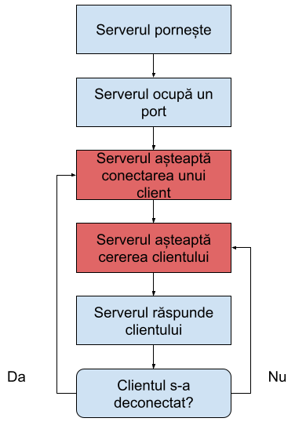

# Introducere în programarea aplicațiile cu comunicare în rețea

---

# Considerații generale

Unități de transfer \(format\, mărime\, reprezentare\)

Protocoale de comunicație

Comunicare unidirecțională/bidirecțională

Cu stare/fără stare

Comunicare erorilor

Extensibilitate

Mecanisme de securitate

---

# Abstracții peste nivelul de aplicație

Reprezentarea unor interacțiuni care folosesc protocoale de nivel aplicație în rolul de canal de transport

Ignoră protocoalele de sub nivelul aplicație

Cel mai cunoscut caz\, utilizarea HTTP pentru accesul la obiecte la distanță

---

# Programarea la nivel transport

Reprezentarea unei interacțiuni care folosește protocoale de nivel transport pentru canalul de comunicație

Servere custom care respectă specificațiile unui protocol de nivel aplicație

Alternativ\, definirea de protocoale custom

La baza programării la nivel transport stau Berkeley sockets

---

# Programarea cu socket-uri

Un socket este o structură care permite unei aplicații programarea comunicării în rețea

În \*nix sunt reprezentate ca un tip special de fișier și pot fi accesate prin descriptori de fișiere

---

# Tipuri de socket-uri

Socket\-uri TCP \(stream sockets\)

Socket\-uri UDP \(datagram sockets\)

Socket\-uri care permit accesul la alte protocoale \(raw sockets\)

---

# Socket-uri TCP

Funcționează pe bază de conexiune

Un client poate face o cerere la server doar după ce s\-a conectat

Presupun operații blocante

Deoarece serverul trebuie să termine comunicarea cu un client înainte de a trece la următorul\, este necesară o abstracție pentru structuri de execuție separate \(thread\-uri\, procese etc\.\)

---

# Fluxul unui server TCP

---

# Server TCP

import   socketserver

class   SimpleHandler\(socketserver\.BaseRequestHandler\)  :

   def     handle  \(  self  \):

     self  \.data =   self  \.request\.recv\(  1024  \)\.strip\(\)

     print  \(  "  \{\}   wrote:"  \.format\(  self  \.client\_address\[  0  \]\)\)

     print  \(  self  \.data\)

     self  \.request\.sendall\(  self  \.data\.upper\(\)\)

HOST\, PORT =   "localhost"  \,   12345

with   socketserver\.TCPServer\(\(HOST\, PORT\)\, SimpleHandler\)   as   server:

   server\.serve\_forever\(\)

---

# Client TCP

import   socket

HOST =   "127\.0\.0\.1"

PORT =   12345

with   socket\.socket\(socket\.AF\_INET\, socket\.SOCK\_STREAM\)   as   s:

   s\.connect\(\(HOST\, PORT\)\)

   s\.sendall\(  b  "Hello\, world"  \)

   data = s\.recv\(  1024  \)

print  \(  f  "Received   \{  data  \!r  \}  "  \)

---

# Probleme specifice pentru servere TCP

Procesarea simultană a cererilor de la clienți multipli

Comunicare bidirecțională

---

# Socket-uri UDP

Funcționează fără o conexiune prealabilă

Orice client poate face o cerere la server în orice ordine

Presupun operații blocante\, dar serverul nu trebuie să termine comunicarea cu un client înainte de a procesa o cerere de la altul

Nu sunt necesare structuri de execuție separate

---

# Server UDP

import   socket

import   sys

PORT =   3333

with   socket\.socket\(socket\.AF\_INET\, socket\.SOCK\_DGRAM\)   as   server\_socket:

 server\_socket\.bind\(\(  ''  \, PORT\)\)

   while     True  :

   message\, address = server\_socket\.recvfrom\(  1024  \)

   server\_socket\.sendto\(message\.upper\(\)\, address\)

---

# Client UDP

import   socket

import   sys

HOST=  '127\.0\.0\.1'

PORT=  3333

with   socket\.socket\(socket\.AF\_INET\, socket\.SOCK\_DGRAM\)   as   client\_socket:

   while     True  :

   data =   input  \(  "Please enter the message:  \\n  "  \)

   client\_socket\.sendto\(data\.encode\(  'utf\-8'  \)\, \(HOST\, PORT\)\)

   message\, address = client\_socket\.recvfrom\(  1024  \)

     print  \(message\)

---

# Probleme specifice pentru servere UDP

Menținerea unei comunicații multi\-cerere cu un anumit client

Confirmarea primirii comenzilor

Comunicare bidirecțională

---

# Programarea sub nivelul transport

Trimiterea de pachete IP construite în interiorul aplicației

---

# Socket-uri RAW

Permit trimiterea de pachete sub nivelul transport \(fără a include header\-ele pentru TCP/UDP\)

Se pot crea cu api\-ul din modulul socket \(tipul este Socket\.RAW\)

---

# Crearea de pachete cu Scapy

Se pot crea pachete la nivel 3 sau nivel 2

Presupune utilizarea unui protocol preimplementat în scapy sau definirea pachetelor la nivel de byte

---

# Exemplu scapy

from   scapy\.all   import   \*

for   i   in     range  \(  1  \,   10  \):

 resp = sr\(IP\(  dst  =  "8\.8\.8\.8"  \)/ICMP\(\)\)

   print  \(resp\)

---

# Lecturi suplimentare

https://www\.rfc\-editor\.org/rfc/rfc3117\.txt

